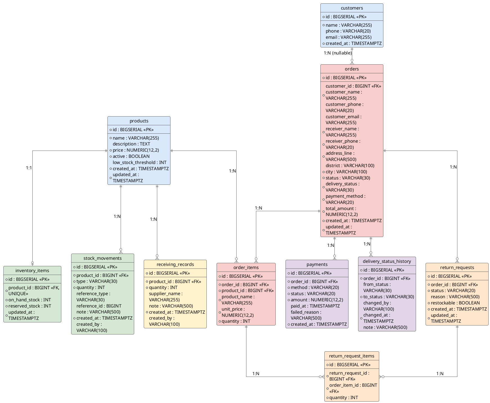
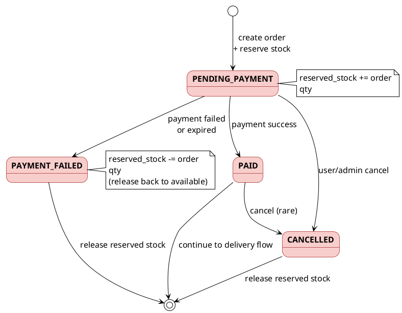
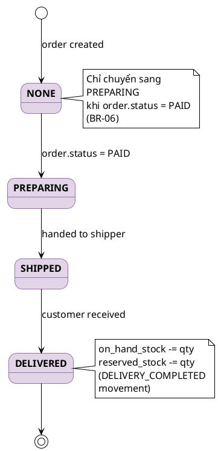
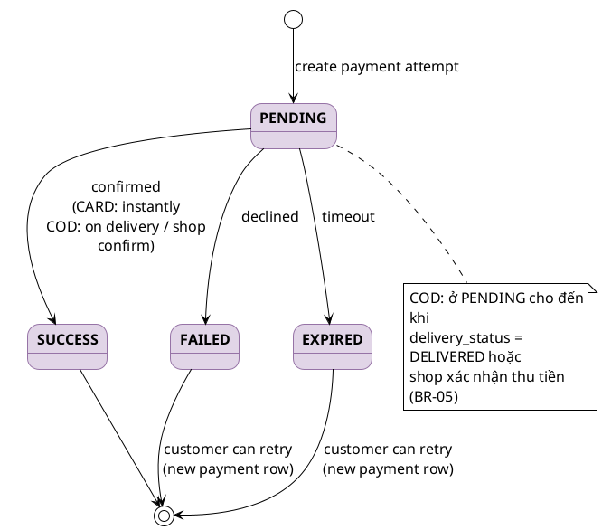
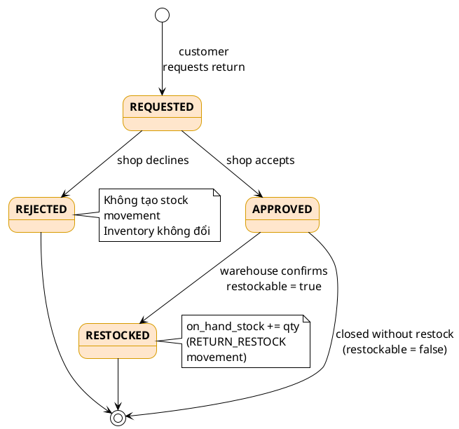
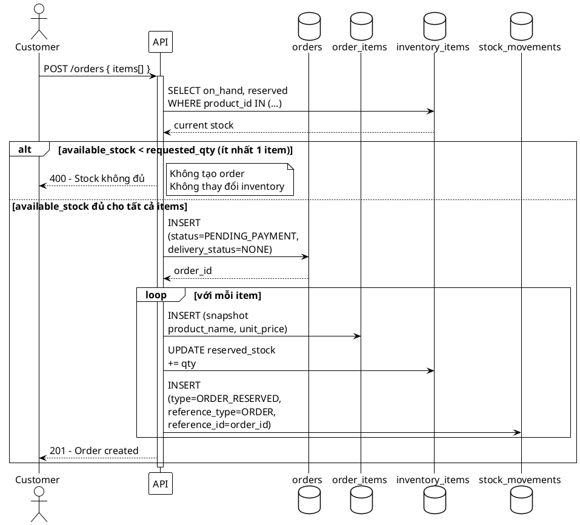
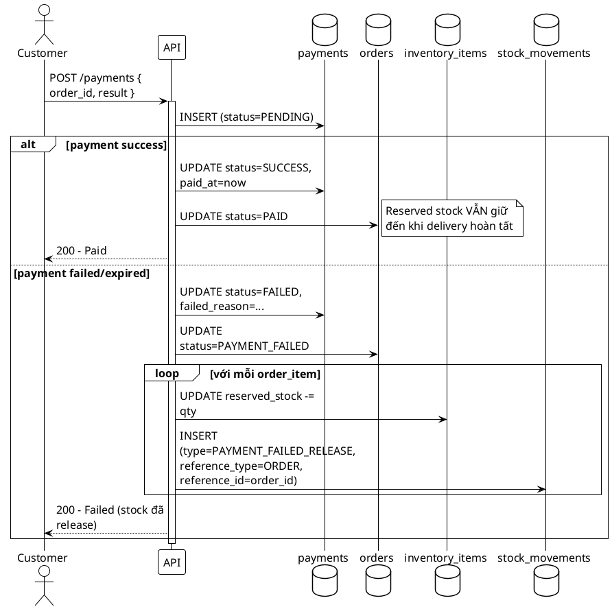
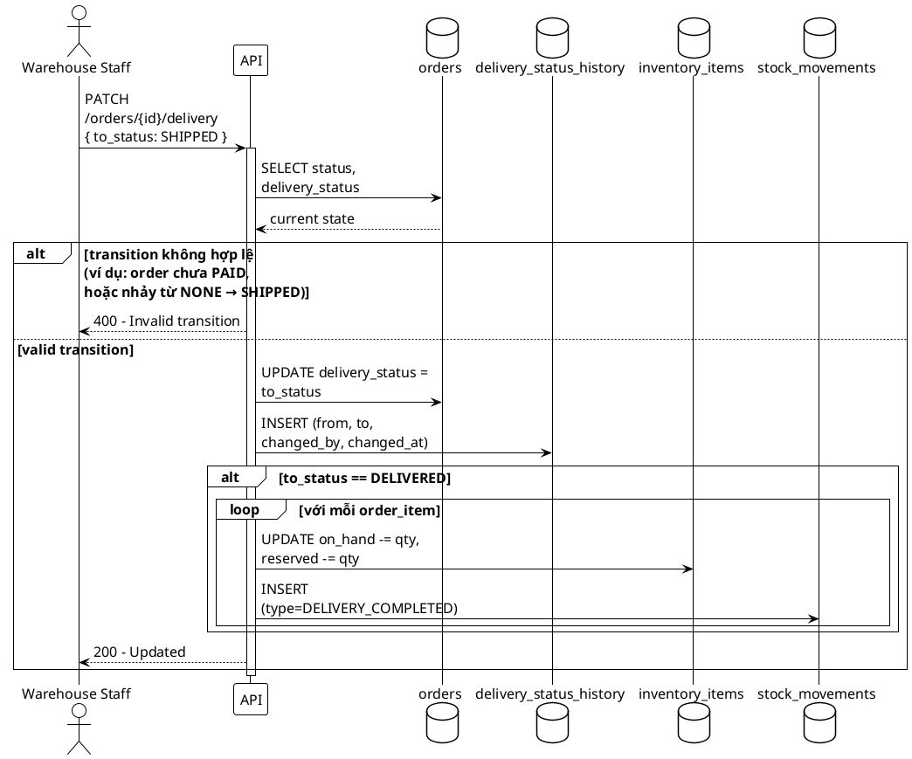
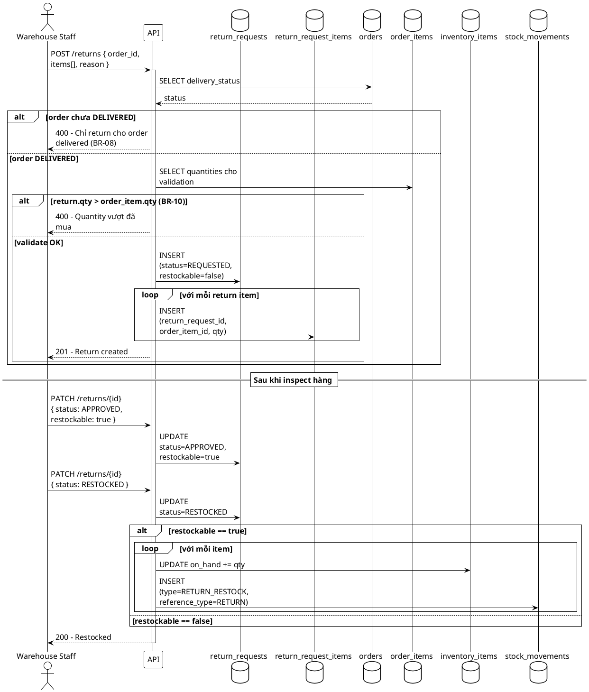
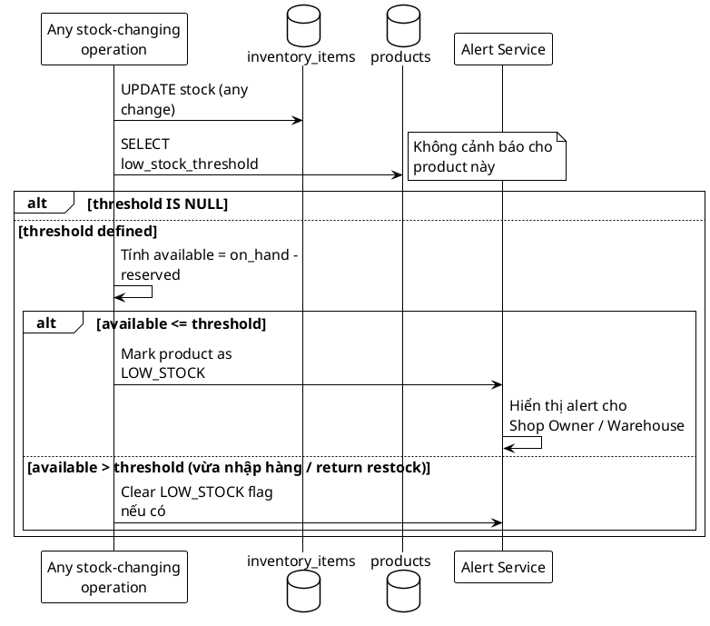

# ShopFlow — Database Schema Documentation

**Phiên bản:** 1.0
**Ngày lập:** 26/05/2026
**Liên quan:**
- [`database-schema.sql`](./database-schema.sql) — DDL PostgreSQL
- [`SRS.md`](./SRS.md) — Software Requirements Specification

---

## Mục lục

1. [Tổng quan thiết kế](#1-tổng-quan-thiết-kế)
2. [Bảng `products`](#2-bảng-products)
3. [Bảng `customers`](#3-bảng-customers)
4. [Bảng `inventory_items`](#4-bảng-inventory_items)
5. [Bảng `orders`](#5-bảng-orders)
6. [Bảng `order_items`](#6-bảng-order_items)
7. [Bảng `payments`](#7-bảng-payments)
8. [Bảng `stock_movements`](#8-bảng-stock_movements)
9. [Bảng `receiving_records`](#9-bảng-receiving_records)
10. [Bảng `return_requests`](#10-bảng-return_requests)
11. [Bảng `return_request_items`](#11-bảng-return_request_items)
12. [Bảng `delivery_status_history`](#12-bảng-delivery_status_history)
13. [Enum values tổng hợp](#13-enum-values-tổng-hợp)
14. [Sequence diagrams — Luồng nghiệp vụ chính](#14-sequence-diagrams--luồng-nghiệp-vụ-chính)

---

## 1. Tổng quan thiết kế

### 1.1 Triết lý thiết kế

| Nguyên tắc | Áp dụng cho |
| --- | --- |
| **3NF làm baseline** | Hầu hết các bảng |
| **Snapshot pattern** (cố ý vi phạm 3NF) | `orders`, `order_items` — bảo toàn dữ liệu lịch sử |
| **Surrogate key** (`BIGSERIAL`) | Tất cả bảng — đơn giản, hiệu năng tốt |
| **Audit trail riêng** | `stock_movements`, `delivery_status_history` — append-only |
| **Computed column** không lưu DB | `available_stock = on_hand_stock - reserved_stock` |
| **CHECK constraints** thay cho ENUM type | Linh hoạt khi thêm trạng thái mới |
| **TIMESTAMPTZ** cho mọi datetime | Tránh sai múi giờ giữa server/client |
| **`NUMERIC(12,2)`** cho tiền | Tránh lỗi floating-point của `FLOAT`/`DOUBLE` |

### 1.2 Sơ đồ quan hệ tóm tắt

```
products ─┬─< inventory_items
          ├─< stock_movements
          ├─< receiving_records
          └─< order_items >─ orders ─┬─< payments
                                     ├─< delivery_status_history
                                     └─< return_requests ─< return_request_items
customers ─< orders
```

Ký hiệu: `>─` = many-to-one, `─<` = one-to-many.

### 1.3 ER Diagram đầy đủ



### 1.4 Nhóm bảng theo chức năng

| Nhóm | Bảng | Mục đích |
| --- | --- | --- |
| **Catalog** | `products`, `customers` | Master data sản phẩm và khách hàng |
| **Order** | `orders`, `order_items` | Đơn hàng và chi tiết |
| **Payment & Delivery** | `payments`, `delivery_status_history` | Thanh toán và giao hàng |
| **Inventory** | `inventory_items`, `stock_movements` | Quản lý tồn kho và audit |
| **Receiving** | `receiving_records` | Nhập hàng từ supplier |
| **Return** | `return_requests`, `return_request_items` | Yêu cầu hoàn hàng |

---

## 2. Bảng `products`

### Mục đích
Master data của sản phẩm — thông tin **chung** của 1 product. Đây là nguồn dữ liệu để dựng Product Catalog (FR-01) và Product Management (FR-12).

### Đặc điểm
- 1 product chỉ có 1 record duy nhất.
- Khi `active = false`, product KHÔNG hiển thị trong catalog của customer (FR-12.4).
- Giá ở đây là **giá hiện tại** — đã bán rồi thì order giữ snapshot riêng.

### Chi tiết trường

| Field | Type | Constraint | Mô tả |
| --- | --- | --- | --- |
| `id` | `BIGSERIAL` | PK | Khóa chính tự tăng. Dùng `BIGSERIAL` thay `SERIAL` để tránh tràn nếu shop lớn (`SERIAL` max ~2.1 tỷ). |
| `name` | `VARCHAR(255)` | NOT NULL | Tên sản phẩm hiển thị trên catalog. 255 ký tự đủ cho mọi tên product hợp lý. |
| `description` | `TEXT` | nullable | Mô tả dài. Dùng `TEXT` thay `VARCHAR(N)` vì không giới hạn độ dài, hiệu năng PostgreSQL tương đương. |
| `price` | `NUMERIC(12,2)` | NOT NULL, ≥ 0 | Giá hiện tại. `(12,2)` = tối đa 10 chữ số phần nguyên + 2 chữ số phần thập phân → đủ cho 9,999,999,999.99 VND. |
| `active` | `BOOLEAN` | NOT NULL, DEFAULT TRUE | `true` = hiển thị catalog. `false` = ẩn nhưng không xóa (giữ tham chiếu cho order cũ). |
| `low_stock_threshold` | `INT` | nullable, ≥ 0 | Ngưỡng cảnh báo hết hàng (FR-08.1). NULL = không cảnh báo cho product này. |
| `created_at` | `TIMESTAMPTZ` | NOT NULL, DEFAULT now | Thời điểm tạo. `TIMESTAMPTZ` lưu kèm timezone, tránh lỗi giờ. |
| `updated_at` | `TIMESTAMPTZ` | NOT NULL, DEFAULT now | Cập nhật mỗi khi sửa product. App tự maintain hoặc dùng trigger. |

### Index

| Index | Lý do |
| --- | --- |
| `idx_products_active` | Catalog query `WHERE active = true` rất thường xuyên. |

### Liên quan SRS
- FR-01 (Browse Product Catalog), FR-08 (Low Stock Alert), FR-12 (Manage Product Information).

---

## 3. Bảng `customers`

### Mục đích
Lưu thông tin khách hàng để (optionally) gắn order với customer profile.

### Đặc điểm
- **Optional trong MVP**: `orders` đã chứa snapshot fields, nên có thể bỏ bảng này.
- Giữ lại để mở rộng sau (customer history, repeat customer, loyalty…).
- Khi customer bị xóa → `orders.customer_id` chuyển NULL (giữ order, mất link).

### Chi tiết trường

| Field | Type | Constraint | Mô tả |
| --- | --- | --- | --- |
| `id` | `BIGSERIAL` | PK | Khóa chính. |
| `name` | `VARCHAR(255)` | NOT NULL | Họ tên khách hàng. |
| `phone` | `VARCHAR(20)` | nullable | Số điện thoại. 20 ký tự đủ cho format quốc tế `+84...`. |
| `email` | `VARCHAR(255)` | nullable | Email. Không UNIQUE vì MVP cho phép guest checkout trùng email. |
| `created_at` | `TIMESTAMPTZ` | NOT NULL | Thời điểm tạo. |

### Index

| Index | Lý do |
| --- | --- |
| `idx_customers_email` | Tìm customer theo email (login giả lập, repeat customer detection). |
| `idx_customers_phone` | Tìm customer theo phone (hotline, support). |

### Liên quan SRS
- §10.1 (data model), Note: customer profile chưa quản lý chi tiết trong MVP.

---

## 4. Bảng `inventory_items`

### Mục đích
Lưu **trạng thái tồn kho** của từng product. Đây là bảng "sống" — số liệu liên tục thay đổi theo nghiệp vụ order/receiving/return.

### Đặc điểm
- **Quan hệ 1-1 với `products`** (UNIQUE constraint trên `product_id`).
- **`available_stock` KHÔNG lưu trong DB** — tính runtime: `on_hand - reserved` (SRS §10.2).
- **CHECK** `reserved_stock <= on_hand_stock` → đảm bảo không reserved nhiều hơn thực có.
- Cập nhật trong transaction cùng với `stock_movements` để đảm bảo nhất quán.

### Chi tiết trường

| Field | Type | Constraint | Mô tả |
| --- | --- | --- | --- |
| `id` | `BIGSERIAL` | PK | Khóa chính. |
| `product_id` | `BIGINT` | FK, UNIQUE, NOT NULL | Sản phẩm. UNIQUE ⇒ 1 product chỉ có 1 inventory_item. |
| `on_hand_stock` | `INT` | NOT NULL, ≥ 0, DEFAULT 0 | Số lượng thực tế đang có trong kho (đã trừ hàng đã giao đi). |
| `reserved_stock` | `INT` | NOT NULL, ≥ 0, DEFAULT 0 | Số lượng đã giữ cho order chưa giao (Pending Payment, Paid, Preparing, Shipped). |
| `updated_at` | `TIMESTAMPTZ` | NOT NULL | Lần cập nhật cuối — debug khi stock lệch. |

### Quy tắc tính

```text
available_stock = on_hand_stock - reserved_stock
```

### Constraint quan trọng

```sql
CHECK (reserved_stock <= on_hand_stock)
```

→ Không cho reserve vượt số hàng thực có. **Sai sót tại DB-level**, không tin app.

### Liên quan SRS
- FR-05 (Manage Inventory Stock), §10.2 (stock formula), BR-01, BR-02, BR-03, BR-04.

---

## 5. Bảng `orders`

### Mục đích
Đơn hàng của customer — entity trung tâm của hệ thống. Lưu cả **state hiện tại** (status, delivery_status) và **snapshot data** (customer info, shipping address) để bảo toàn dữ liệu lịch sử.

### Đặc điểm
- **Snapshot pattern**: `customer_name`, `customer_phone`, `customer_email`, shipping fields đều inline trong bảng → order không bị ảnh hưởng khi customer đổi thông tin.
- **State machine**: `status` (PENDING_PAYMENT → PAID/PAYMENT_FAILED) và `delivery_status` (NONE → PREPARING → SHIPPED → DELIVERED) độc lập nhau.
- `customer_id` nullable: hỗ trợ guest checkout.

### Chi tiết trường

| Field | Type | Constraint | Mô tả |
| --- | --- | --- | --- |
| `id` | `BIGSERIAL` | PK | Khóa chính. Cũng dùng làm order code hiển thị cho customer. |
| `customer_id` | `BIGINT` | FK, nullable | Link tới customer profile (nếu có). NULL = guest. ON DELETE SET NULL. |
| `customer_name` | `VARCHAR(255)` | NOT NULL | **Snapshot** tên khách lúc đặt — không đổi khi customer sửa profile. |
| `customer_phone` | `VARCHAR(20)` | nullable | **Snapshot** SĐT. |
| `customer_email` | `VARCHAR(255)` | nullable | **Snapshot** email. |
| `receiver_name` | `VARCHAR(255)` | NOT NULL | Tên người nhận hàng (có thể khác customer). |
| `receiver_phone` | `VARCHAR(20)` | NOT NULL | SĐT người nhận — shipper gọi. |
| `address_line` | `VARCHAR(500)` | NOT NULL | Địa chỉ chi tiết (số nhà, đường, phường). |
| `district` | `VARCHAR(100)` | nullable | Quận/huyện. |
| `city` | `VARCHAR(100)` | NOT NULL | Tỉnh/thành phố. |
| `status` | `VARCHAR(30)` | NOT NULL, CHECK | Trạng thái thanh toán/order: `PENDING_PAYMENT`, `PAID`, `PAYMENT_FAILED`, `CANCELLED`. |
| `delivery_status` | `VARCHAR(30)` | NOT NULL, CHECK | Trạng thái giao hàng: `NONE`, `PREPARING`, `SHIPPED`, `DELIVERED`. Bắt đầu `NONE`. |
| `payment_method` | `VARCHAR(20)` | NOT NULL, CHECK | `CARD` hoặc `COD`. |
| `total_amount` | `NUMERIC(12,2)` | NOT NULL, ≥ 0 | Tổng tiền order. Tính sẵn để khỏi SUM order_items mỗi lần. Bằng `SUM(unit_price × quantity)`. |
| `created_at` | `TIMESTAMPTZ` | NOT NULL | Thời điểm tạo order. |
| `updated_at` | `TIMESTAMPTZ` | NOT NULL | Lần cập nhật cuối. |

### Lifecycle — `status`



### Lifecycle — `delivery_status`



### Index

| Index | Lý do |
| --- | --- |
| `idx_orders_customer_id` | Lấy order theo customer (FR-10 dashboard). |
| `idx_orders_status` | Filter order theo status (dashboard). |
| `idx_orders_delivery_status` | Filter order theo delivery (warehouse view). |
| `idx_orders_created_at DESC` | List order mới nhất trước (UX phổ biến). |

### Liên quan SRS
- FR-02, FR-03, FR-04, FR-10. BR-01 đến BR-07.

---

## 6. Bảng `order_items`

### Mục đích
Chi tiết từng dòng sản phẩm trong order. Mỗi order có 1-N order_items.

### Đặc điểm
- **Snapshot pattern**: `product_name` và `unit_price` lưu tại thời điểm mua → bảo toàn hóa đơn đúng (price không đổi khi shop sửa giá).
- `product_id` vẫn giữ FK để link tracking (xem sản phẩm nào bán chạy…).
- ON DELETE CASCADE khi order bị xóa.

### Chi tiết trường

| Field | Type | Constraint | Mô tả |
| --- | --- | --- | --- |
| `id` | `BIGSERIAL` | PK | Khóa chính. |
| `order_id` | `BIGINT` | FK, NOT NULL | Order chứa item này. ON DELETE CASCADE. |
| `product_id` | `BIGINT` | FK, NOT NULL | Sản phẩm. ON DELETE RESTRICT — không cho xóa product nếu đã có order. |
| `product_name` | `VARCHAR(255)` | NOT NULL | **Snapshot** tên product lúc đặt. |
| `unit_price` | `NUMERIC(12,2)` | NOT NULL, ≥ 0 | **Snapshot** giá lúc đặt. KHÔNG dùng giá hiện tại từ `products.price`. |
| `quantity` | `INT` | NOT NULL, > 0 | Số lượng đặt. Phải dương — CHECK ở DB. |

### Vì sao cần snapshot?

| Tình huống | Không snapshot | Có snapshot |
| --- | --- | --- |
| Shop sửa giá từ 1tr → 1.5tr | Hóa đơn cũ ra 1.5tr (sai) | Vẫn 1tr (đúng) |
| Shop đổi tên "iPhone 15" → "iPhone 15 Pro" | Hóa đơn cũ hiển thị tên mới (sai) | Vẫn tên cũ (đúng) |
| Customer khiếu nại 6 tháng sau | Khó tra lại trạng thái lúc đó | Tra được chính xác |

### Index

| Index | Lý do |
| --- | --- |
| `idx_order_items_order_id` | Lấy tất cả items của 1 order. |
| `idx_order_items_product_id` | Báo cáo "sản phẩm X đã bán bao nhiêu". |

### Liên quan SRS
- FR-02.6, §10.1.

---

## 7. Bảng `payments`

### Mục đích
Lưu lịch sử **các lần thử thanh toán** cho 1 order. Hỗ trợ retry payment khi customer thanh toán lần đầu thất bại.

### Đặc điểm
- **1 order có thể có N payment records** (retry → tạo record mới, không overwrite).
- Payment thành công gần nhất (status=SUCCESS) quyết định `orders.status = PAID`.
- ON DELETE CASCADE khi order bị xóa.

### Chi tiết trường

| Field | Type | Constraint | Mô tả |
| --- | --- | --- | --- |
| `id` | `BIGSERIAL` | PK | Khóa chính. |
| `order_id` | `BIGINT` | FK, NOT NULL | Order được thanh toán. CASCADE. |
| `method` | `VARCHAR(20)` | NOT NULL, CHECK | `CARD` hoặc `COD`. |
| `status` | `VARCHAR(20)` | NOT NULL, CHECK | `PENDING`, `SUCCESS`, `FAILED`, `EXPIRED`. |
| `amount` | `NUMERIC(12,2)` | NOT NULL, ≥ 0 | Số tiền thanh toán. Thường = `orders.total_amount`. |
| `paid_at` | `TIMESTAMPTZ` | nullable | Thời điểm thanh toán thành công. NULL khi PENDING/FAILED. |
| `failed_reason` | `VARCHAR(500)` | nullable | Lý do thất bại — debug. |
| `created_at` | `TIMESTAMPTZ` | NOT NULL | Thời điểm tạo record (bắt đầu attempt). |

### Lifecycle — `status`



### COD special case (BR-05)

Với `method = 'COD'`, `status` **chỉ chuyển SUCCESS** khi:
- Delivery đã `DELIVERED`, **hoặc**
- Shop Owner xác nhận đã thu tiền (manual confirm).

Trước đó vẫn là `PENDING` dù order đã `PAID`.

### Index

| Index | Lý do |
| --- | --- |
| `idx_payments_order_id` | Lấy lịch sử payment của 1 order. |
| `idx_payments_status` | Filter các payment đang PENDING (job retry, COD cần confirm). |

### Liên quan SRS
- FR-03, BR-04, BR-05.

---

## 8. Bảng `stock_movements`

### Mục đích
**Audit trail trung tâm** — ghi lại MỌI thay đổi tồn kho. Đây là bảng quan trọng nhất cho compliance & debugging.

### Đặc điểm
- **Append-only**: không bao giờ UPDATE hay DELETE. Chỉ INSERT.
- **Polymorphic FK**: `reference_type` + `reference_id` trỏ đến table nguồn (orders, receiving_records, return_requests, hoặc NULL cho manual adjustment).
- Mỗi nghiệp vụ làm đổi stock đều phải tạo 1 record (BR-13).

### Chi tiết trường

| Field | Type | Constraint | Mô tả |
| --- | --- | --- | --- |
| `id` | `BIGSERIAL` | PK | Khóa chính. |
| `product_id` | `BIGINT` | FK, NOT NULL | Sản phẩm bị ảnh hưởng. ON DELETE RESTRICT. |
| `type` | `VARCHAR(30)` | NOT NULL, CHECK | Loại thay đổi: `ORDER_RESERVED`, `PAYMENT_FAILED_RELEASE`, `STOCK_RECEIVED`, `MANUAL_ADJUSTMENT`, `RETURN_RESTOCK`, `DELIVERY_COMPLETED`. |
| `quantity` | `INT` | NOT NULL | Số lượng thay đổi. **Có thể âm** (giảm) hoặc dương (tăng). |
| `reference_type` | `VARCHAR(30)` | nullable, CHECK | Bảng nguồn: `ORDER`, `RECEIVING`, `RETURN`, `ADJUSTMENT`. |
| `reference_id` | `BIGINT` | nullable | ID record trong bảng nguồn. |
| `note` | `VARCHAR(500)` | nullable | Ghi chú thêm, đặc biệt cho manual adjustment. |
| `created_at` | `TIMESTAMPTZ` | NOT NULL | Thời điểm phát sinh. |
| `created_by` | `VARCHAR(100)` | nullable | Username/role gây ra. NULL nếu hệ thống tự sinh. |

### Mapping `type` → ảnh hưởng inventory

| type | on_hand | reserved | Khi nào |
| --- | --- | --- | --- |
| `ORDER_RESERVED` | — | +qty | Order tạo thành công |
| `PAYMENT_FAILED_RELEASE` | — | -qty | Payment failed/expired |
| `STOCK_RECEIVED` | +qty | — | Nhập hàng từ supplier |
| `MANUAL_ADJUSTMENT` | ±qty | — | Warehouse staff điều chỉnh |
| `RETURN_RESTOCK` | +qty | — | Return được nhập lại kho |
| `DELIVERY_COMPLETED` | -qty | -qty | Order delivered (hàng rời kho thật sự) |

### Vì sao dùng polymorphic FK?

Một bảng audit mà ngại 4 FK riêng cho ORDER/RECEIVING/RETURN/ADJUSTMENT → dùng `reference_type` + `reference_id` cho gọn. **Trade-off**: mất referential integrity ở DB-level cho 4 link này → app phải đảm bảo.

### Index

| Index | Lý do |
| --- | --- |
| `idx_stock_movements_product_created` | Lịch sử movement theo product (FR-11.6). |
| `idx_stock_movements_reference` | Tìm tất cả movement của 1 reference (debug). |

### Liên quan SRS
- FR-11 (Inventory Movement History), BR-13, §10.3.

---

## 9. Bảng `receiving_records`

### Mục đích
Ghi nhận nghiệp vụ **nhập hàng từ supplier** — phục vụ audit và truy vết.

### Đặc điểm
- Mỗi lần nhập hàng = 1 record. KHÔNG ghép nhiều lần nhập vào 1 record.
- Tạo record này **phải đi kèm** tạo `stock_movements` (type=STOCK_RECEIVED) và update `inventory_items.on_hand_stock`.
- Trong MVP chưa quản lý supplier profile → chỉ lưu tên text (`supplier_name`).

### Chi tiết trường

| Field | Type | Constraint | Mô tả |
| --- | --- | --- | --- |
| `id` | `BIGSERIAL` | PK | Khóa chính. |
| `product_id` | `BIGINT` | FK, NOT NULL | Sản phẩm được nhập. ON DELETE RESTRICT. |
| `quantity` | `INT` | NOT NULL, > 0 | Số lượng nhập. Phải dương (FR-06.2). |
| `supplier_name` | `VARCHAR(255)` | nullable | Tên nhà cung cấp (free text trong MVP). |
| `note` | `VARCHAR(500)` | nullable | Ghi chú (hóa đơn, người giao…). |
| `created_at` | `TIMESTAMPTZ` | NOT NULL | Thời điểm nhập. |
| `created_by` | `VARCHAR(100)` | nullable | Warehouse staff thực hiện. |

### Index

| Index | Lý do |
| --- | --- |
| `idx_receiving_records_product_id` | Lịch sử nhập của 1 product. |
| `idx_receiving_records_created_at DESC` | Báo cáo nhập gần đây. |

### Liên quan SRS
- FR-06 (Receive Supplier Stock).

---

## 10. Bảng `return_requests`

### Mục đích
Yêu cầu hoàn hàng từ customer cho 1 order **đã delivered**.

### Đặc điểm
- 1 order có thể có nhiều return request (nhiều lần hoàn).
- Chỉ tạo được khi `orders.delivery_status = DELIVERED` (BR ở app-level).
- ON DELETE RESTRICT — không xóa order nếu có return.

### Chi tiết trường

| Field | Type | Constraint | Mô tả |
| --- | --- | --- | --- |
| `id` | `BIGSERIAL` | PK | Khóa chính. |
| `order_id` | `BIGINT` | FK, NOT NULL | Order được hoàn. |
| `status` | `VARCHAR(20)` | NOT NULL, CHECK | `REQUESTED`, `APPROVED`, `RESTOCKED`, `REJECTED`. |
| `reason` | `VARCHAR(500)` | nullable | Lý do hoàn (customer khai). |
| `restockable` | `BOOLEAN` | NOT NULL, DEFAULT FALSE | Hàng có nhập lại kho được không. Quyết định bởi warehouse staff khi inspect (BR-09). |
| `created_at` | `TIMESTAMPTZ` | NOT NULL | Thời điểm yêu cầu. |
| `updated_at` | `TIMESTAMPTZ` | NOT NULL | Lần cập nhật cuối (chuyển status). |

### Lifecycle



### Quan trọng: `restockable`

- `restockable = true` + `status = RESTOCKED` → tạo `stock_movements` (type=RETURN_RESTOCK), tăng `on_hand`.
- `restockable = false` (hàng hỏng) → KHÔNG tạo stock movement → không tăng on_hand (BR-09).

### Index

| Index | Lý do |
| --- | --- |
| `idx_return_requests_order_id` | Lấy return của 1 order. |
| `idx_return_requests_status` | Lọc return đang chờ xử lý. |

### Liên quan SRS
- FR-07 (Process Customer Return), BR-08, BR-09, BR-10.

---

## 11. Bảng `return_request_items`

### Mục đích
Cho phép **partial return** — customer chỉ hoàn 1 phần order, không phải toàn bộ.

### Đặc điểm
- Mỗi row = "muốn hoàn `quantity` đơn vị của `order_item_id`".
- Validate ở app-level: `quantity ≤ order_items.quantity` (BR-10).
- ON DELETE CASCADE khi return_request bị xóa.

### Chi tiết trường

| Field | Type | Constraint | Mô tả |
| --- | --- | --- | --- |
| `id` | `BIGSERIAL` | PK | Khóa chính. |
| `return_request_id` | `BIGINT` | FK, NOT NULL | Return request cha. CASCADE. |
| `order_item_id` | `BIGINT` | FK, NOT NULL | Dòng order_item bị hoàn. RESTRICT — không xóa order_item nếu có return. |
| `quantity` | `INT` | NOT NULL, > 0 | Số lượng hoàn. |

### Index

| Index | Lý do |
| --- | --- |
| `idx_return_items_request_id` | Lấy items của 1 return. |
| `idx_return_items_order_item_id` | Tìm return của 1 order_item. |

### Liên quan SRS
- FR-07.2, BR-10, Open Question #3.

---

## 12. Bảng `delivery_status_history`

### Mục đích
**Audit trail** cho thay đổi `orders.delivery_status` — FR-04.4 yêu cầu "lưu lịch sử thay đổi delivery status để kiểm tra lại".

### Đặc điểm
- Append-only. Mỗi lần update `delivery_status` → INSERT 1 record.
- Trigger hoặc app-level đảm bảo việc ghi.

### Chi tiết trường

| Field | Type | Constraint | Mô tả |
| --- | --- | --- | --- |
| `id` | `BIGSERIAL` | PK | Khóa chính. |
| `order_id` | `BIGINT` | FK, NOT NULL | Order bị thay đổi. CASCADE. |
| `from_status` | `VARCHAR(30)` | nullable, CHECK | Status TRƯỚC khi thay đổi. NULL = lần đầu. |
| `to_status` | `VARCHAR(30)` | NOT NULL, CHECK | Status SAU khi thay đổi. |
| `changed_by` | `VARCHAR(100)` | nullable | Username/role thực hiện. |
| `changed_at` | `TIMESTAMPTZ` | NOT NULL | Thời điểm thay đổi. |
| `note` | `VARCHAR(500)` | nullable | Ghi chú thêm (lý do chuyển trạng thái…). |

### Vì sao tách bảng riêng?

| Cách | Ưu | Nhược |
| --- | --- | --- |
| Tách bảng (hiện tại) | Audit đầy đủ, không bloat orders | Thêm 1 bảng |
| Lưu JSON array trong orders | Đơn giản | Khó query lịch sử, không index được |
| Không lưu | Đơn giản nhất | Vi phạm FR-04.4 |

### Index

| Index | Lý do |
| --- | --- |
| `idx_delivery_history_order_changed` | Lấy lịch sử theo thứ tự thời gian. |

### Liên quan SRS
- FR-04.4.

---

## 13. Enum values tổng hợp

Tài liệu nhanh các giá trị enum dùng trong CHECK constraints — tránh phải lướt khắp file để tra.

### `orders.status`
| Value | Mô tả |
| --- | --- |
| `PENDING_PAYMENT` | Mới tạo, chờ thanh toán |
| `PAID` | Đã thanh toán thành công |
| `PAYMENT_FAILED` | Thanh toán thất bại/hết hạn |
| `CANCELLED` | Hủy bởi customer/shop |

### `orders.delivery_status` + `delivery_status_history.from/to_status`
| Value | Mô tả |
| --- | --- |
| `NONE` | Chưa vào delivery flow (order chưa paid) |
| `PREPARING` | Đang đóng gói tại kho |
| `SHIPPED` | Đã giao cho shipper |
| `DELIVERED` | Đã giao thành công |

### `orders.payment_method` + `payments.method`
| Value | Mô tả |
| --- | --- |
| `CARD` | Mô phỏng thanh toán thẻ |
| `COD` | Thanh toán khi nhận hàng |

### `payments.status`
| Value | Mô tả |
| --- | --- |
| `PENDING` | Đang chờ xử lý (COD chưa giao xong) |
| `SUCCESS` | Thanh toán thành công |
| `FAILED` | Bị từ chối |
| `EXPIRED` | Quá hạn |

### `stock_movements.type`
| Value | Khi phát sinh | Ảnh hưởng |
| --- | --- | --- |
| `ORDER_RESERVED` | Tạo order | reserved += qty |
| `PAYMENT_FAILED_RELEASE` | Payment failed | reserved -= qty |
| `STOCK_RECEIVED` | Nhập hàng | on_hand += qty |
| `MANUAL_ADJUSTMENT` | Điều chỉnh thủ công | on_hand ±= qty |
| `RETURN_RESTOCK` | Return nhập lại | on_hand += qty |
| `DELIVERY_COMPLETED` | Order delivered | on_hand, reserved -= qty |

### `stock_movements.reference_type`
| Value | Trỏ tới |
| --- | --- |
| `ORDER` | `orders.id` |
| `RECEIVING` | `receiving_records.id` |
| `RETURN` | `return_requests.id` |
| `ADJUSTMENT` | NULL (manual, không reference) |

### `return_requests.status`
| Value | Mô tả |
| --- | --- |
| `REQUESTED` | Mới yêu cầu |
| `APPROVED` | Đã duyệt, chờ nhập kho |
| `RESTOCKED` | Đã nhập lại kho |
| `REJECTED` | Từ chối |

---

## 14. Sequence diagrams — Luồng nghiệp vụ chính

Phần này minh họa cách các bảng tương tác trong các nghiệp vụ quan trọng nhất.

### 14.1 Tạo order + reserve stock (FR-02)



### 14.2 Payment success/failure (FR-03)



### 14.3 Cập nhật delivery status (FR-04)



### 14.4 Xử lý return + restock (FR-07)



### 14.5 Low stock alert (FR-08)



---

## Phụ lục: Quy ước đặt tên

| Loại | Quy ước | Ví dụ |
| --- | --- | --- |
| Tên bảng | `snake_case`, **số nhiều** | `products`, `order_items` |
| Tên cột | `snake_case` | `created_at`, `low_stock_threshold` |
| Khóa chính | `id` | — |
| Khóa ngoại | `{table_singular}_id` | `product_id`, `order_id` |
| Index | `idx_{table}_{cols}` | `idx_orders_status` |
| FK constraint | `fk_{table}_{ref_table}` | `fk_orders_customer` |
| CHECK constraint | `chk_{table}_{col}` | `chk_orders_status` |
| Datetime | `_at` suffix, `TIMESTAMPTZ` | `created_at`, `paid_at` |
| Boolean | adj không tiền tố `is_` | `active`, `restockable` |
| Enum (chuỗi) | `UPPER_SNAKE_CASE` | `PENDING_PAYMENT`, `ORDER_RESERVED` |
